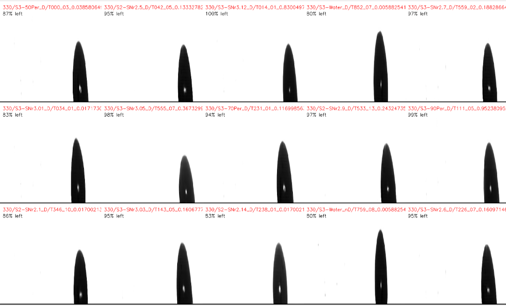

# Multi Video Player (MVP)

<!--  -->

**A high-performance, side-by-side video wall for efficient experiment review.**

MVP allows researchers to decode, resize, and display up to **15 videos simultaneously**, significantly reducing the time required for anomaly detection and qualitative analysis across large datasets.

---

## 📸 Interface Preview

---

## 🚀 Why It Exists

Experimental workflows often generate thousands of structurally identical video outputs. Sequential review is inefficient and prone to cognitive fatigue.

*   **SIMD-Style Analysis**: Apply "Single Instruction, Multiple Data" principles to visual inspection.
*   **Anomaly Detection**: Synchronized views make outliers jump out immediately.
*   **Cognitive Load**: Reduces the mental burden of remembering previous videos by showing them side-by-side.

## ✨ Key Features

*   **Massive Concurrency**: Opens and plays up to 15 videos simultaneously in a uniform grid.
*   **Smart Normalization**: Automatically resizes frames to a fixed common resolution.
*   **Hybrid Architecture**:
*   **Python**: Rapid development, utilizing OpenCV for decoding and NumPy for vectorized frame stacking.
*   **C++**: Optimized for maximum throughput and lower latency.
*   **Analyst Tools**: Real-time overlays for file paths and playback progress.

## 🎮 Controls

| Key | Action |
| :--- | :--- |
| **Space** | Pause / Resume all videos |
| **Left / Right** | Step backward / forward (Frame-by-frame) |
| **A** | Toggle **A**nnotation (File paths) |
| **V** | Toggle **V**isual progress bar |
| **F** | Toggle **F**ull-screen mode |
| **Q** | **Q**uit application |

## 🏗 Technical Architecture

The system operates as a batch processing pipeline optimized for rendering throughput:

1.  **Ingest**: Decodes frames using FFMPEG backend via OpenCV.
2.  **Normalize**: Resizes all streams to a common (H, W) tuple using linear interpolation.
3.  **Composite**:
    *   **Python**: Uses `numpy.vstack` and `numpy.hstack` for memory-contiguous buffer operations.
    *   **C++**: Uses `cv::vconcat` and `cv::hconcat` with pre-allocated buffers.
4.  **Render**: Displays the composite frame in a single window context.

**Performance Note**: Efficiency is maximized when source videos share resolution and codecs. The pipeline minimizes dynamic memory allocation during the playback loop.

## 📂 Project Layout

*   `main.py` - Core Python implementation and entry point.
*   `OpenCV/video_grid/video_grid.cpp` - High-performance C++ grid renderer.
*   `Meta/` - Documentation assets and figures.

## 🗓 Roadmap

*   [ ] **GPU Acceleration**: Complete C++ port with OpenGL and CUDA builds of OpenCV for GPU-resident decode and compositing.
*   [ ] **Configuration**: Add presets for common grid sizes (e.g., 2x2, 4x4).
*   [ ] **CLI Tooling**: Add CLI batch launcher for curated video sets.
*   [ ] **Pipeline**: Add GPU pipeline to avoid VRAM-to-RAM transfers.
*   [ ] **Parity**: Make Python version with OpenGL; add CUDA support to C++ version; aim for full feature parity.

---

## 📝 Changelog

### Python Implementation (`main.py`)

*   **[Unreleased] - 2025-09-03**
    *   **Added**: Enhanced type hinting for parameters/returns.
    *   **Changed**: Return value boolean consistency, cleanup imports.
    *   **Goal**: Better maintainability and reduced runtime errors.

*   **v2.0.0 - 2025-08-04**
    *   **Added**: Full-screen (`F`), "Always on Top", flexible nested video discovery.
    *   **Changed**: Improved label format, removed hardcoded sleeps.
    *   **Fixed**: Cleanup logic and path extraction.

*   **v1.0.0 - 2025-07-29**
    *   Initial release: 3x5 grid, synchronous playback, FFMPEG backend.
    *   Batch processing of 15 videos/batch.

### C++ Implementation (`video_grid.cpp`)

*   **v1.0.0 - 2025-07-29**
    *   Port of Python logic to C++17.
    *   **Performance**: Dynamic window sizing, pre-allocated buffers.
    *   **Note**: Requires custom OpenCV build with CUDA modules.

### Development History
*   **2025-09-03**: Python type-safety and code quality.
*   **2025-08-04**: Python v2.0 feature expansion.
*   **2025-07-29**: Initial dual-language prototypes.

---

## 📄 License & Contact

This project is licensed under the terms found in the `LICENSE` file.

**Contribution & Support**:
For questions or improvements, please reach out to **Yassin Riyazi** at [iyasiniyasin98@gmail.com](mailto:iyasiniyasin98@gmail.com).
